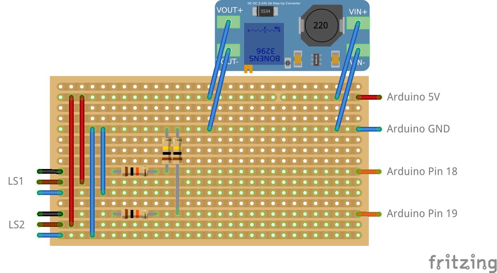

# Geschwindigkeitsmessanlage fürs Kliemannsland

Dies ist die Dokumentation und der Programmcode zur Geschwindigkeitsmessanlage, die ich fürs Kliemannsland entwickelt habe. Das Video ist hier zu finden: https://www.youtube.com/watch?v=S8LNk1IF994

Ein paar Anpassungen sind nach dem Video entstanden bzw. der Einfachheit halber im Video nicht erwähnt worden. Die Bilder und der Programmcode sollten aber aussagekräftig genug sein. Falls nicht, gerne hier oder per Instagram ( https://www.instagram.com/shocker0815/ ) nachfragen.

## Entwicklungsumgebung
Als Entwicklungsumgebung wird platform.io genutzt, da die Entwicklung deutlich komfortabler ist als mit der Arduino Entwicklungsumgebung. Außerdem ist das Teilen von Projekten deutlich einfacher, da alle Abhängigkeiten sauber angegeben werden können. Ein guter Einstieg ist folgender Artikel: https://www.heise.de/ct/artikel/Mikrocontroller-bequem-programmieren-mit-PlatformIO-4403209.html

## BoM
Folgende Bauteile wurden für den Bau verwendet:
* 1x Arduino Mega 2560 R3 ( https://amzn.to/339GwiX *)
* 1x TFT Display ( https://amzn.to/3k2rEKj *)
* 1x Step Up Wandler ( https://amzn.to/2GARE0I *)
* 2x Lichtschranken ( https://www.voelkner.de/products/944726/DataLogic-Reflexions-Lichtschranke-S100-PR-2-B10-PK-950811290-Polarisationsfilter-10-30-V-DC-1St..html )
* 2x Reflektoren ( https://www.voelkner.de/products/944722/DataLogic-S940700075-Reflektor-R5-Ausfuehrung-allgemein-Rund-1St..html )
* Breadboard, Jumper Kabel ( https://amzn.to/339kVY3 *)
* Widerstände 2x 10kOhm, 2x 100kOhm ( https://amzn.to/2FaTbdB *)

Die mit Stern (*) gekennzeichneten Links sind sogenannte Affiliate-Links. Wenn du auf einen Affiliate-Link klickst und über diesen Link einkaufst, werde ich am Umsatz beteiligt. Für dich verändert sich der Preis dadurch nicht. Als Amazon-Partner verdiene ich an qualifizierten Käufen.

## Zusatzplatine
Die Versorgung der Lichtschranken, sowie die Signalwandlung sieht wie folgt aus. Dabei ist zu beachten, dass das Streifenraster an drei Stellen unterbrochen werden muss: Unter dem StepUp-Wandler, sowie unter den beiden horizontalen Widerständen. Vor dem Verbinden der Lichtschranken mit dem StepUp-Wandler, ist letzterer auf eine passende Ausgangsspannung (12V) einzustellen.

Die horizontalen Widerstände (10kOhm) begrenzen den Strom durch die Lichtschranke. Die vertikalen Widerstände (100kOhm) sind PullDown-Widerstände um einen definierten Pegel herzustellen wenn der Transistor in der Lichtschranke offen ist.

## Todo
* Rundenzeiten anzeigen
* Blitzerausgang anschließen und ansteuern
* Code aufräumen (Code aus .h Dateien raus und "vernünftige" Klassen machen (if it works it ain't stupid))
* Gehäuse drucken
